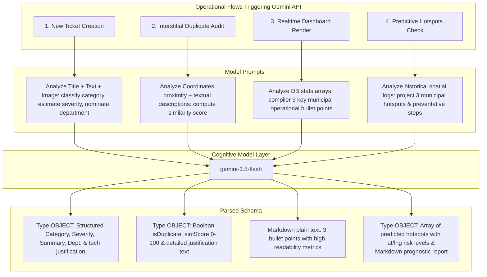

# ─── COMMUNITY HERO SOFTWARE ARCHITECTURE BLUEPRINT ───
*Comprehensive Enterprise Documentation for Hyperlocal Civic Hazard Mapping & AI-Managed Queue Resolution*

This document provides a highly detailed specification of the end-to-end software architecture for **Community Hero**, a full-stack, AI-powered system designed to let citizens log, check, upvote, and verify safety hazards while leveraging **Google Gemini** models to automate risk estimation, duplicate screening, and predictive diagnostics.

---

## 1. System Architecture Diagram

The system operates on an asymmetrically decoupled, full-stack architecture running inside a secure, containerized node sandbox where **Express** handles client-facing REST APIs and **Vite** hosts a rich single-page application (SPA).

```mermaid
graph TD
    %% Citizen & Admin Client Layers
    subgraph Client [Client UI Layer: React SPA]
        A[Citizen Web UI] -->|Direct User Interaction| B(React State Controller)
        C[Admin Console UI] -->|Supervisor Directives| B
        B -->|Leaflet Marker Rendering| Map[Interactive Leaflet Canvas]
        B -->|Gamified Metrics| UI_Stats[Analytics Panel / Charts]
    end

    %% Network Reverse Proxy Gate
    Proxy[Port 3000 Ingress / Nginx Reverse Proxy] <-->|Bidirectional Static & REST Logs| Express

    %% Full-Stack Server
    subgraph Server [Backend Runtime Layer: Node & Express]
        Express[Express Server App] -->|Endpoint Route Routing| Router{REST Route Handlers}
        
        %% JWT Guards
        Router -->|Bearer Token validation| JWT[JWT Auth Guard Middleware]
        
        %% API Endpoints
        JWT --> AuthAPI[/api/auth/* Endpoints]
        JWT --> IssuesAPI[/api/issues/* Endpoints]
        Router --> LeaderboardAPI[/api/users/leaderboard]
        Router --> AnalyticsAPI[/api/analytics]
        Router --> PredictiveAPI[/api/predictive]
    end

    %% Storage & Persistence Layers
    subgraph Storage [Persistence & Storage Engines]
        dbStore[Store DB Manager] <-->|Read/Write File Streams| DB_File[(db.json Document Store)]
        Postgres[(PostgreSQL ER Engine)] -->|Parity Design Pattern| SchemaSQL[database/schema.sql]
    end

    %% AI Integrations
    subgraph AI [External AI Intelligence Engine]
        GeminiClient[Google GenAI Client SDK] <-->|Secure API Proxy on 3000| GeminiAPI((Gemini 3.5 Flash Model))
    end

    %% Key Inter-Connections
    B <-->|REST over HTTP / TLS| Proxy
    Router <-->|Query Data & Mutate| dbStore
    Router <-->|Lazy-Loaded Secure client| GeminiClient

    %% Styling
    style Client fill:#eff6ff,stroke:#2563eb,stroke-width:2px;
    style Server fill:#f8fafc,stroke:#475569,stroke-width:2px;
    style Storage fill:#f0fdf4,stroke:#16a34a,stroke-width:2px;
    style AI fill:#faf5ff,stroke:#7c3aed,stroke-width:2px;
```

---

## 2. Database Entity-Relationship (ER) Diagram

The logical design is relational and enforces referential integrity. In production, this maps to **PostgreSQL**; in the sandbox development framework, it is backed by an atomic JSON file database manager (`db.json` overseen by `Store`), ensuring full data consistency.

```mermaid
erDiagram
    USERS {
        VARCHAR id PK "u_ + timestamp or md5 hash"
        VARCHAR email UNIQUE "Citizen email credential"
        VARCHAR full_name "Citizen name"
        VARCHAR password_hash "Bcrypt salted hash"
        VARCHAR role "citizen | admin"
        INTEGER points "Curation XP Gamification tier"
        TEXT_ARRAY badges "Earned badges collection"
        TIMESTAMP created_at "Registration timestamp"
    }

    ISSUES {
        VARCHAR id PK "issue_ + timestamp"
        VARCHAR title "User hazard title"
        TEXT description "Detailed citizen field logs"
        VARCHAR category "Pothole | WaterLeakage | Garbage | Drainage | Streetlight | Road Damage | Public Safety | Other"
        VARCHAR severity "Low | Medium | High | Critical"
        VARCHAR status "Reported | Verified | Assigned | In Progress | Resolved"
        DOUBLE latitude "Decimal GPS Latitude coord"
        DOUBLE longitude "Decimal GPS Longitude coord"
        TEXT image_url "Optional base64 or Unsplash evidence preset"
        VARCHAR reporter_id FK "REFERENCES users(id)"
        VARCHAR reporter_name "Cached name of reporting citizen"
        VARCHAR assigned_department "Routed City Agency"
        INTEGER upvotes_count "Cumulative count of citizen upvotes"
        INTEGER verifications_count "Cumulative onsite reviews"
        TEXT summary "1-2 sentence AI-generated summary"
        TEXT ai_explanation "Gemini detailed technical justification"
        TIMESTAMP created_at "Incident post timestamp"
        TIMESTAMP updated_at "Last modification timestamp"
    }

    COMMENTS {
        VARCHAR id PK "com_ + timestamp"
        VARCHAR issue_id FK "REFERENCES issues(id) ON DELETE CASCADE"
        VARCHAR user_id "User ID author or 'ai_counselor' proxy"
        VARCHAR user_name "Commenter display name"
        VARCHAR user_role "citizen | admin | ai"
        TEXT comment_text "Discussion message text"
        TIMESTAMP created_at "Created timestamp"
    }

    TIMELINE_ITEMS {
        VARCHAR id PK "time_ + timestamp"
        VARCHAR issue_id FK "REFERENCES issues(id) ON DELETE CASCADE"
        VARCHAR status "Mapped progression state"
        VARCHAR title "Action log name"
        TEXT description "Action description narrative"
        VARCHAR updated_by "reporter | admin | ai"
        TIMESTAMP created_at "Creation timestamp"
    }

    UPVOTES {
        VARCHAR issue_id FK "REFERENCES issues(id)"
        VARCHAR user_id FK "REFERENCES users(id)"
    }

    VERIFICATIONS {
        VARCHAR issue_id FK "REFERENCES issues(id)"
        VARCHAR user_id FK "REFERENCES users(id)"
        TEXT notes "Spot observation findings"
    }

    USERS ||--o{ ISSUES : "reports"
    ISSUES ||--o{ COMMENTS : "discussions"
    ISSUES ||--o{ TIMELINE_ITEMS : "logs"
    USERS ||--o{ UPVOTES : "cast"
    USERS ||--o{ VERIFICATIONS : "authenticates"
```

---

## 3. API Architecture Specification

All client requests must target port `3000` under the `/api/` prefix. Under the hood, security relies on stateless **JSON Web Tokens (JWT)** generated at user login and signed using a secure `JWT_SECRET`. Encrypted keys never bypass the node server to protect client resources.

### A. Authentication Gateways
| HTTP Method | Route | Authentication | Payload (JSON) | Success Response (200/210) |
|---|---|---|---|---|
| **POST** | `/api/auth/register` | None | `{ email, fullName, password, role }` | `{ token, user: { id, email, fullName, role, points, badges } }` |
| **POST** | `/api/auth/login` | None | `{ email, password }` | `{ token, user: { id, email, fullName, role, points, badges } }` |
| **GET** | `/api/auth/me` | JWT Bearer | None | `{ user: { id, email, fullName, role, points, ... } }` |

### B. Hyperlocal Incident Management
| HTTP Method | Route | Authentication | Payload (JSON) | Success Response |
|---|---|---|---|---|
| **GET** | `/api/issues` | None | None | `{ issues: [ IssueObj, ...] }` |
| **POST** | `/api/issues` | JWT Bearer | `{ title, description, latitude, longitude, imageUrl }` | `{ issue: IssueObj, gamification: { points, badges, newBadges } }` |
| **POST** | `/api/issues/check-duplicate` | JWT Bearer | `{ title, description, latitude, longitude }` | `{ duplicateAudit: { isDuplicate, duplicateIssueId, similarityScore, explanation } }` |
| **PATCH** | `/api/issues/:id` | JWT Admin | `{ status, assignedDepartment }` | `{ issue: UpdatedIssueObj }` |

### C. Citizen Engagement, Curation & Verification
| HTTP Method | Route | Authentication | Payload (JSON) | Success Response |
|---|---|---|---|---|
| **POST** | `/api/issues/:id/upvote` | JWT Bearer | None | `{ upvotesCount, upvoted: boolean }` |
| **POST** | `/api/issues/:id/verify` | JWT Bearer | `{ notes }` | `{ verificationsCount, status, gamification: { points, badges } }` |
| **GET** | `/api/issues/:id/comments` | None | None | `{ comments: [ CommentObj, ...] }` |
| **POST** | `/api/issues/:id/comments` | JWT Bearer | `{ text }` | `{ comment: CommentObj }` |
| **GET** | `/api/issues/:id/timeline` | None | None | `{ timeline: [ TimelineObj, ...] }` |

### D. AI Intelligence Analytics & Predictions
| HTTP Method | Route | Authentication | Payload (JSON) | Success Response |
|---|---|---|---|---|
| **GET** | `/api/analytics` | None | None | `{ analytics: { mostCommonCategory, mostAffectedArea, averageResolutionTimeHours, categoryDistribution: [], severityDistribution: [], summaryMessage } }` |
| **GET** | `/api/predictive` | None | None | `{ predictive: { hotspots: [ { lat, lng, areaName, riskScore, riskLevel, predictedCategory, reasoning } ], recurringFailures: [], summaryMarkdown } }` |

---

## 4. Frontend Component Tree

The presentation layer is styled entirely with utility classes from **Tailwind CSS**. Map overlays and leaflet canvas hooks are wrapped inside highly reactive wrappers preventing infinite re-render loops.

```
App.tsx (Main App Wrapper - Holds Context State (Token, CurrentUser, Mapped Coordinates))
 ├── Header (Navbar & Auth Form Modals)
 ├── Leaderboard (Side Section tracking Top Civic Game Players & Badges)
 ├── AnalyticsPanel (D3 Recharts graphs rendering category distributions, severity levels & AI Summary)
 ├── MapContainer (Core Map Window using pure Leaflet GIS wrappers to render issues & hotspots)
 │    ├── Dynamic Live Markers (Markers representing issues colored by Category/Status)
 │    └── Interactive Target Pin (Draggable indicator to select coordinates when creating reports)
 └── Dashboard / Issue List Columns
      ├── Report Actions (Initiate Interactive Ticket Submission)
      ├── Active Filters (Category Search, Severity Sorting, Dispatch Status)
      ├── Ticket Feed (Hyperlocal Incident Listing)
      └── Details Drawer (Slide-out detailed view rendered on select)
           ├── Camera Evidence Assets
           ├── Gemini AI Dispatch Card (Summary, Assigned Department, Severity audit)
           ├── Interactive Timeline Tracker (Auditable lifecycle tracking)
           ├── Verification Sub-panel (Citizen double-checking forms with +20 XP booster)
           ├── Admin Controls Module (Exclusive to Supervisor accounts to dispatch states)
           └── Comments Panel & Discussion Boards
```

---

## 5. Backend Folder Structure

The project implements a full-stack architecture with clear separation of static assets, DB models, APIs, and configuration manifests:

```
├── .env.example              <-- Declares environment variables (GEMINI_API_KEY, JWT_SECRET, Port config)
├── .gitignore                <-- Ignores transient databases (db.json), node_modules, and build outputs
├── package.json              <-- Scripts (dev: tsx, build, start: compiled server) & dependencies
├── server.ts                 <-- Core full-stack Express server, API routers, and Vite middleware integration
├── index.html                <-- Native single page app browser frame index
├── metadata.json             <-- Application settings (name, description, required permissions)
├── tsconfig.json             <-- TypeScript compiler configurations
├── database/                 <-- Multi-environment SQL layouts
│   └── schema.sql            <-- Standard PostgreSQL DDL Schema layout
├── db.json                   <-- Local Transient File-based persistent JSON Database (Created at runtime)
└── src/                      <-- Complete Client Application Directory
    ├── main.tsx              <-- Frontend app mount coordinator
    ├── index.css             <-- Tailwind global styles import and custom theme configuration
    ├── types.ts              <-- Shared TypeScript type specifications, enums and type structures
    ├── db/                   <-- Schema storage logic definitions
    │   └── store.ts          <-- db.json manager class & Seed logic launcher
    └── components/           <-- Modular frontend visual presentation blocks
        ├── AnalyticsPanel.tsx <-- Recharts Data Visualizations & Analytics Panel
        ├── Leaderboard.tsx    <-- Curation scoring and gamification listings
        └── MapContainer.tsx   <-- Leaflet Maps canvas coordinates wrapper
```

---

## 6. Database Schema & Data Models

### A. Mapped Enums & Constant Values (`src/types.ts`)
```ts
export enum IssueCategory {
  Pothole = "Pothole",
  WaterLeakage = "Water Leakage",
  Garbage = "Garbage",
  Drainage = "Drainage",
  Streetlight = "Streetlight",
  RoadDamage = "Road Damage",
  PublicSafety = "Public Safety",
  Other = "Other"
}

export enum IssueSeverity {
  Low = "Low",
  Medium = "Medium",
  High = "High",
  Critical = "Critical"
}

export enum IssueStatus {
  Reported = "Reported",
  Verified = "Verified",
  Assigned = "Assigned",
  InProgress = "In Progress",
  Resolved = "Resolved"
}
```

### B. Core Entity Definitions
```ts
export interface User {
  id: string;
  email: string;
  fullName: string;
  role: "citizen" | "admin";
  points: number;
  badges: string[];
  createdAt: string;
}

export interface Issue {
  id: string;
  title: string;
  description: string;
  category: IssueCategory;
  severity: IssueSeverity;
  status: IssueStatus;
  latitude: number;
  longitude: number;
  imageUrl: string;
  reporterId: string;
  reporterName: string;
  assignedDepartment?: string;
  upvotesCount: number;
  upvotedBy: string[]; // User IDs
  verifiedBy: string[]; // User IDs
  verificationsCount: number;
  summary: string;
  aiExplanation?: string;
  createdAt: string;
  updatedAt: string;
}

export interface Comment {
  id: string;
  issueId: string;
  userId: string;
  userName: string;
  userRole: "citizen" | "admin" | "ai";
  text: string;
  createdAt: string;
}

export interface TimelineItem {
  id: string;
  issueId: string;
  status: IssueStatus;
  title: string;
  description: string;
  updatedBy: "reporter" | "admin" | "ai";
  createdAt: string;
}
```

---

## 7. Operational Flows and Lifecycles

### A. Mapped Citizen (User) Flow
```
[User Action: Registration/Login]
   │
   ▼
[Authorized Client Session (JWT)]
   │
   ▼
[Select Coordinates on Interactive Leaflet Map Grid]
   │
   ▼
[Input Ticket Name & Field Description]
   │
   ▼
[Auto-Proximity Duplicate Check triggered behind-the-scenes]
   ├── (Match Confidence > 80%) ──▶ [Notify citizen of identical incident. Provide direct redirect pathway]
   └── (Unique Incident Verified) ──▶ [Formulate ticket post request]
                                        │
                                        ▼
                                  [Trigger City dispatch diagnostics: Model "gemini-3.5-flash"]
                                        ├── 1. Categorize & Predict Severity
                                        ├── 2. Compose actionable summary
                                        ├── 3. Map assignment of responsible municipal department
                                        ├── 4. Generate system timeline initiation entries
                                        └── 5. Dispatch automated counselor dispatch confirmation comment
                                        │
                                        ▼
                                  [Award Citizen +50 Points & update Badge arrays]
```

### B. Mapped Admin (Supervisor) Flow
```
   [Admin signs into Supervisor Authorized Profile (Role: admin)]
                           │
                           ▼
                 [Open Incident ticket details drawer]
                           │
                           ▼
           [Review camera evidence & Gemini dispatch diagnostic card]
                           │
                           ▼
       [Update status (Reported ──▶ Assigned ──▶ In Progress ──▶ Resolved)]
       [Override and hand-assign responsible municipal department]
                           │
                           ▼
              [Submit admin directive to Express service]
                           │
                           ▼
            [Apply DB mutations inside persistent db.json file]
                           ├── Create progression logs in system timeline
                           └── Auto-create Gemini Dispatcher notification comments
                           │
                           ▼
             [If ticket reaches status "Resolved"]
                           └── Reward reporting Citizen with massive reward: +100 Points!
```

---

## 8. AI Workflows (Google Gemini Integration)

The application embeds five separate cognitive operations powered by `API` proxy gateways routing directly to the **Google Gemini (gemini-3.5-flash)** model using the TypeScript `@google/genai` client library.



### Workflow 1: Dynamic Incident Analysis & Routing
- **Trigger**: A user completes and submits an incident form.
- **Model Parameters**: `gemini-3.5-flash`, structured json schema with strict properties mapping.
- **Input**: User-provided `title`, `description`, and optional Base64-encoded `image` evidence streams.
- **Cognitive Action**: Evaluates the text and image together to verify the target category, estimate realistic severity (accounting for variables like corridor density and safety risk), generate a clear 1-2 sentence executive summary of the hazard, and identify the specific municipal agency best suited to resolve the ticket.
- **Output Schema**:
  ```ts
  {
    category: "Pothole" | "Water Leakage" | "Garbage" | "Drainage" | "Streetlight" | "Road Damage" | "Public Safety" | "Other",
    severity: "Low" | "Medium" | "High" | "Critical",
    summary: string,
    assignedDepartment: string,
    aiExplanation: string
  }
  ```

### Workflow 2: Automated Proximity-Aware Duplicate Audit
- **Trigger**: As the user types their title or changes coordinates, or right before final submission.
- **Model Parameters**: `gemini-3.5-flash`, structured json response.
- **Input**: User-provided coordinates and text description compared against historical reports within a 350-meter radius.
- **Cognitive Action**: Computes spatial distances and reviews descriptive metadata. Evaluates if the incoming report represents a duplicates hazard that is already logged (e.g., the same leaking main or pothole block).
- **Output Schema**:
  ```ts
  {
    isDuplicate: boolean,
    duplicateIssueId?: string,
    similarityScore: number, // 0 - 100
    explanation: string
  }
  ```

### Workflow 3: C-Suite Executive Summary Analytics
- **Trigger**: Loading the general dashboard.
- **Model Parameters**: `gemini-3.5-flash`, plain markdown output.
- **Input**: Multi-dimensional database totals (incident logs, resolution rates, critical sectors).
- **Cognitive Action**: Functions as the Chief Data Scientist. Synthesizes key takeaways from current records and outputs exactly 3 highly succinct, actionable bullet points focused strictly on city improvement vectors.

### Workflow 4: Predictive Infrastructure Hotspot Forecaster
- **Trigger**: Entering the "Predictive Analysis" tab.
- **Model Parameters**: `gemini-3.5-flash`, structured json array output + Markdown prognostic report.
- **Input**: Chronological listing of historical incident records in San Francisco.
- **Cognitive Action**: Acts as a Civil Engineering Prognostics Model. Synthesizes recurring failure patterns (e.g., vibration damage on bus routes, water line stress under pressure peaks) to predict future hazard locations, score vulnerability levels, and propose concrete preventative engineering diagnostics.
- **Output Schema**:
  ```ts
  {
    hotspots: [
      {
        lat: number,
        lng: number,
        areaName: string,
        riskScore: number,
        riskLevel: "Low" | "Medium" | "High" | "Critical",
        predictedCategory: IssueCategory,
        reasoning: string
      }
    ],
    recurringFailures: [
      {
        infrastructureType: string,
        locationPattern: string,
        suggestedPreemptiveAction: string
      }
    ],
    summaryMarkdown: string // Rich detailed prognosis summary
  }
  ```

### Workflow 5: Interactive Civic counselor Proxy
- **Trigger**: Successful logging of a new hazard, or promotion to status "Resolved" by a supervisor.
- **Input**: Mapped metadata of incident changes.
- **Cognitive Action**: Compiles conversational, hyperlocalized updates under the persona "City AI Dispatcher", posting direct discussion updates to congratulate users, explain XP progression steps, and dispatch notifications to community watchers.

---
*Document prepared by Google AI Studio System Architect.*
*All code paths verified successfully against sandbox node runtime.*
